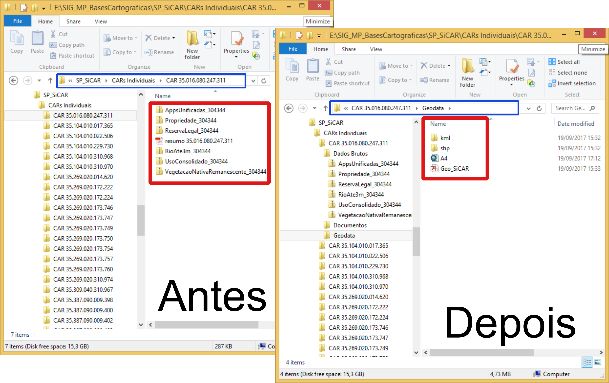

# ArcGIS-SiCAR

 

Conjunto de Scripts para analisar os shapefiles, KMLs e PDFs extraídos da plataforma SiCAR, da Secretaria do Meio Ambiente do Estado de São Paulo.

 

---

## Para que serve?

A partir de uma necessidade de analisar todos os Cadastros Ambientais Rurais de uma usina de cana-de-açúcar, composta por várias propriedades rurais e, portanto vários CARs distintos, decidi escrever um código que analisasse o material disponibilizado pela Secretaria do Meio Ambiente do Estado de São Paulo.

Inicialmente (_Etapa_1_CARs_Individuais.py_) buscava que os diversos arquivos zipados, contendo _shapefiles_ e outros arquivos, fossem automaticamente transformados em uma base de dados do ArcGIS (_geodatabase_), com a edição inclusive das tabelas de atributos.

Posteriormente (_Etapa_2_CARs_Somados.py_) necessitava que todos os diversos CARs fossem unidos em apenas uma base de dados, facilitando análises e interpretações.

 

---

### Etapa_1_CARs_Individuais.py

Script elaborado para organizar os shapefiles, arquivos KML/KMZ e PDFs exportados pelo [SiCAR](http://www.ambiente.sp.gov.br/sicar/), da SMA.
A análise é feita em lote, ou seja, todos os CARs que estiverem dentro de uma dada pasta serão analisados.

O nome das subpastas deve conter, obrigatoriamente, o número do CAR sendo que QUAISQUER OUTROS CARACTERES SERÃO IGNORADOS! _Por exemplo: para a pasta com nome de "CAR 35.458.030.247.579" será utilizado o número "35458030247579" para identificar o CAR_. Esse número estará nas tabelas de atributos dos _shapefiles_. Portanto, recomenda-se a não utilização de outros números na pasta.

Ajuste apenas a pasta aonde se encontram as subpastas com o CARs, identificada no Script como **_# Variável de Input_**.

 

---

### Etapa_2_CARs_Somados.py

Já este _script_ une todos os CARs Individuais em apenas uma base de dados (_geodatabase_).

Ajuste apenas a pasta aonde se encontram as subpastas com o CARs, identificada no Script como **_# Variável de Input_**.

 

---

## Como "instalar" e usar?

Fazer o _download_ (ou cópia) do arquivo [Etapa_1_CARs_Individuais.py](Scripts/Etapa_1_CARs_Individuais.py) e executar.
Caso queira unir os CARs individuais em uma mesma base de dados, fazer o mesmo para [Etapa_2_CARs_Somados.py](Scripts/Etapa_2_CARs_Somados.py).

 

---

## Pré-requisitos

- ArcGIS instalado;

Testado com as versões 10.5.

 

---

## Autor

- **Michel Metran**, veja [outros projetos](https://github.com/michelmetran).

Veja também a lista de [colaboradores](https://github.com/michelmetran/ArcGIS-Transformation/settings/collaboration) que auxiliaram nesse projeto.

 

---

## Licença

Esse projeto é licenciado sob a 'MIT License'.
Veja o arquivo [LICENSE](LICENSE) para detalhes.
